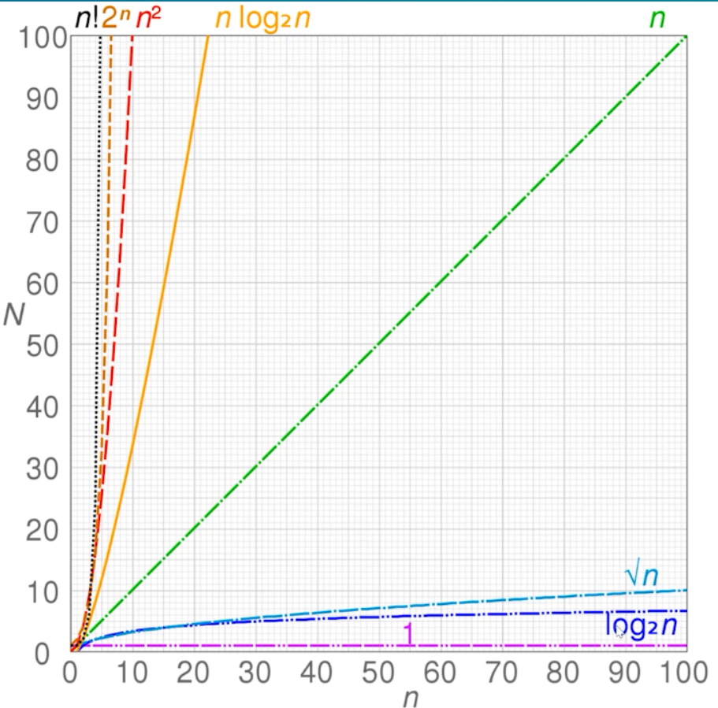

# 开始学习数据结构与算法，一定要拿下！

## 时间复杂度与空间复杂度

### 时间复杂度

时间复杂度就是一个函数，使用大写O来表示，例如：`O(1), O(n), O(logN)...`

主要用于定性描述算法的运行时间，一个大概的时间



- O(1)时间复杂的代码

```js
// 下面的代码，时间复杂度就是O(1)，因为每次在执行代码的时候，这两行代码永远都只会被执行一次，没有嵌套循环之类的，所以时间复杂度为1
let i = 0;
i += 1;
```

- O(n) 代码

```js
// 这三行的时间复杂度就为n，因为包含循环，随着n的增大循环次数相应增多。
for(let i = 0; i < n; i += 1) {
  console.log(i);
}
```

- O(logn) 这个时间复杂度比较特殊，因为计算机是二进制，所以对数一般都是以2为底，所以也可以写作O(lgn)，但是如果是其他的底数就不一样了， 而且因为底数log<sub>a</sub>n一般都是常数，所以一般去掉底数直接写成O(
  logn)

```js
// 这里的代码执行次数就相当于lgn了，以2为底数  设代码执行x次 所以 2^x >= n 所以 x = lgn
let i = 1;
while(i < n) {
  console.log(i);
  i *= 2;
}
```

- 时间复杂度的算法

```js
// 时间复杂度的相加一般都会取时间复杂度较大的作为结果。
// 像这样的前后排列的时间复杂度，我们就把它相加 O(1) + O(n) = O(n) 在时间复杂度的计算里，常数是可以忽略不计的，因为随着n的增大，常数依然是常数
let i = 0;
i += 1;
for(let j = 0; j < n; j += 1) {
  console.log(j);
}
```

```js
// 像这样嵌套的循环 我们就直接相乘 O(n) * O(n) = O(n^2);  相乘与相加是不一样的
for(let i = 0; i < n; i += 1) {
  for(let j = 0; j < n; j += 1) {
    console.log(i, j);
  }
}
```

### 空间复杂度

一个函数，同样使用O表示，例如：`O(1), O(n), O(n^2)...`

算法在运行过程中临时占用的存储空间大小的量度，占用空间越小就越好。

- O(1)

```js
// 因为只声明了一个变量，所以只占用一个内存，具体是堆还是栈这里不讨论
let i = 0;
i += 1;
```

- O(n)

```js
// 因为声明了一个数组，数组中存在n个值，所以为O(n)，哪个i再使用完后会被回收，所以不占用内存
const list = [];
for(let i = 0; i < n; i += 1) {
  list.push(i);
}
```

- O(n<sup>2</sup>)

```js
// 一个二维数组
const matrix = [];
for(let i = 0; i < n; i += 1) {
  matrix.push([]);
  for(let j = 0; j < n; j += 1) {
    matrix[i].push(j);
  }
}
```

## 栈 Stack

后进先出，只有一个进口一个出口。push进，pop出

### 栈的应用场景

需要后进先出的场景，例如：十进制转二进制、判断字符串的括号是否有效、函数调用堆栈等。

- 十进制转二进制，其实十进制转n进制都是可以的，

比如说 16转成二进制，`17/2=8...0 8/2=4...0 4/2=2...0 2/2=1...0 1/2=0...1` 最终结果就是 10000 所以就是后进先出

- 判断字符串括号（小括号，方括号，花括号嵌套都可以使用）的有效性

比如 `{([])[[]{}]{{}}}` 我们遍历字符串，将遇到的左括号就压入栈中，如果遇到正确的右括号就直接出栈，如果遇到的右括号不正确，那么直接报错。 如果是单一类型的括号就判断最后栈是否为空就可以了。

```ts
// 只列出目前看来的最优解
function isValidOfficial(s: string) {
  if (s.length % 2 === 1) {
    return false;
  }
  const stack = [];
  const match = new Map([[')', '('], [']', '['], ['}', '{']]);
  for (let i of s) {
    if (match.has(i)) {
      // 这里也可以使用stack.pop()代替stack[stack.length -1]
      if (!stack.length || match.get(i) !== stack[stack.length - 1]) {
        return false;
      }
      stack.pop();
      // 但是我觉得这里可以直接不要这个else
    } else {
      stack.push(i);
    }

  }
  return !stack.length
}
```

- 函数调用堆栈，与括号问题差不多，最后调用的函数是先执行完的，比如下面的代码，js解释器一般就是使用栈来控制函数的调用顺序

```js
function greeting() {
  // [1] some code
  sayHi();
  // [2] some code
}

function sayHi() {
  return 'Hi!';
}

// 调用 greeting函数
greeting();

// [3] some code 
```

## 队列 Queue

先进先出的数据结构，enqueue叫做入队，dequeue叫做出队，一个出口一个进口

### 队列的应用场景

所有需要先进先出的问题。

- 食堂排队打饭
- js异步中的任务队列，js是单线程，无法同时处理异步中的并发任务（回调函数）就引入了队列来先后处理
- 计算最近请求次数，使用队列配合while，重点其实是while

这是一个算法题

```ts
// 只列出目前的最优解。
// *这里是经过优化后的版本，还有一版是不要这个if-else判断的，但是要这个判断好像整体性能会更好一点
class RecentCounter {
  queue: number[] = [];

  ping(t: number): number {
    if (!this.queue.length) {
      this.queue.push(t);
    } else {
      this.queue.push(t);
      // *重点是这个while循环，当我们不确定循环次数时，首先就可以考虑while循环，而且重点是这里的while循环
      // *改变了数组，但是因为使用this.queue[0]依然是始终指向第一个的。
      // !冷知识，如果是在循环中修改了数组（添加或者删除元素这样的修改）那么可能会导致index指向错误，需要手动修改index
      // !可以在for，for-in，for-of，filter试一下，都是这样的，但是这里的while循环不会有这样的问题。
      while (this.queue[0] < t - 3000) {
        this.queue.shift()
      }
      ;
    }
    return this.queue.length;
  }
}

const resArr = [];
const recent = new RecentCounter();
resArr.push(recent.ping(642));
resArr.push(recent.ping(1849));
resArr.push(recent.ping(4921));
resArr.push(recent.ping(5957));
```

## 链表

在大学里面学习数据结构的时候也接触了，当时使用的还是c

最基础的链表大概就是，分为两个部分：第一个部分存储链表中的数据，第二个部分是指针，指向下一个链表；然后还有一个head指针，指向头部。

- 链表与数组的区别： 数组中增删元素会引起其他元素的移动，链表进行增删不会引起其他元素的移动，但是随之而来的查找元素时需要遍历整个链表。

### 前端里的链表

[mdn-proto](https://developer.mozilla.org/zh-CN/docs/Web/JavaScript/Reference/Global_Objects/Object/proto)

其实原型链就是一个非常标准的链表，只是它的next变成了__proto__，很早之前就学过，` function.__prop__ = Function.prototype `可以说非常典型了。

但是注意__proto__最初不是ES标准中的，最初它只是各个浏览器制定的标准，但是后续为了保证Web浏览器的兼容性，它在ES2015被纳入了标准，但是一直处于废弃的状态，因为直接操作__proto__
是非常危险的，而且性能非常低下，所以我们应该尽量不要使用__proto__,后续它很可能被移除掉。

#### instance

instance就是专门从原型链上查找原型的，比如说 `array instance Object` 得出的结论为true，
` array.__prop__ = Array.prototype , Array.prototype.__proto__ = Object.prototype` 所以为true。对 ` A instance B `
来说只要A的原型链上有B.prototype那么就为true

##### 面试题：手写实现instance的代码

根据上面得知就是通过遍历变量的元素链，然后判断是否有目标变量的prototype就可以了

### 算法-删除链表中的节点

题号： 237，半天没有看懂题和给出的函数（只接收一个参数，不知道啥意思），所以直接看了解题过程。

难点：一般删除链表的方式都是将上个节点的next指向被删除的下一个节点，但是在这道题里不能找到上一个节点，所以我们通过代替它的方法删除这个节点。 也就是将需要被删除的节点的val和next，统统等于下一个节点的值
`deletedNode.val = deletedNextNode.val; deletedNode.next = deletedNextNode.next.next` 这样就等于是让下一个节点，
代替了这个节点，没有任何节点再指向下一个节点。

### 算法-反转链表

- 递归做法

```ts
// 这是我自己的作品，也是使用递归完成的，但是性能较差
function reverseList(head: ListNode | null): ListNode | null {
  // *开始进行优化
  // *首先 这里先判断head或者head.next是否为null，如果为null，那么直接返回 这也是递归的出口
  if (head === null || head.next === null) {
    return head;
  }
  // 经过上面一步 head.next 一定存在，所以这里进行递归，并且取得返回值，
  let node = reverseList(head.next) as ListNode;
  // !这里是我原本的写法  其实这里最开始我的想法也是与下面一样，n长度的链表看作， 1与(n-1)的结合，这个样只需要不断对(n-1)进行
  // !递归，始终都是两个节点的交换，！！但是！！我在交换的时候使用的是最基本的交换方法，使用第三个数存储，然后进行交换。
  // !这样还是没有理解到链表的精髓。
  // let node_head = node;
  // while (node.next) {
  //   node = node.next;
  // }
  // let flag = node.next;
  // node.next = head
  // head.next = flag;
  // return node_head;

  // !这里是改良后的写法，这里非常重要！
  // !这里进行交换的方法，就是链表的精髓。 比如有一个 1、2、3、4传入方法，我们写一下进行的步骤
  // 第一次  1, reverseList(2, 3, 4);
  // 第二次  2, reverseList(3, 4);
  // 第三次  3, reverseList(4);
  // 第四次  4  4.next === null; 所以直接返回 4
  // 进入第三个， 这个时候 head->3,3.next->4,4.next ->null  有一个重要的点就是，这个时候的head.next是不会改变的，这里可能有点难理解，我们直接让这里交换成功，那么就是 4.next->3,3.next->null
  // 然后进入第二个，这里就又要用到哪个 head.next 是不会改变的这个原则了，  head->2,2.next->3,3.next->null, 虽然返回的是 4，3，但是2开始就是指向3的，而且一直没有进行改变，所以这里的2依然指向3
  // 所以无论什么情况使用下面这个交换方法都是可行的。 也就是真真正正的 1与(n-1)进行交换。
  // !上面方法使用错误的原因就是没有理解到此时的head依然指向原本顺序的下一个节点。 然后通过遍历获取到最后一个节点，
  // !将head放到最后一个节点后，因为原本node指向头部，但是经过遍历指向了尾部又不得不新建一个变量来存放头部，然后返回
  head.next.next = head;
  head.next = null;
  return node;
};
```

- 非递归做法

```ts
// !开始的时候，我的想法是类似于冒泡排序那种做法，但是那种做法时间复杂度太高了，然后我看到官方图解里面的时间复杂度可以为O(n) 于是自己想着做
// !甚至还少声明了一个变量
function reverseListNotRecursion(head: ListNode | null): ListNode | null {
  // *交换的方法是我通过画图，然后找到问题，声明变量找出来的，因为有了递归的神奇交换方法，也算对链表的理解加深了吧
  // !具体的过程就是 例如head->1->2->3->4->null, 第一步将1与2交换，就变成了2=head->1->3->4->null，然后再将连接3和2
  // !变成了3->2=head->1->4->null 然后再连接4和3就变成了 4->3->2=head->1->null 这个时候就反转完成了，我们可以发现head一直指向1
  // !我们需要将1.next->1.next.next然后再将1.next.next指向头部，比如4->3->2...这样，但是重点是，仅靠head不能完成单向链表这样完成
  // !所以就需要变量辅助，newHead就是专门用于指向新的头部，而two就直接指向了1的下一个node
  let newHead = head;
  while (head?.next) {
    let two = head.next;
    head.next = two.next;
    two.next = newHead;
    newHead = two;
  }
  return newHead;
}

// 这是官方的做法，我的做法与官方差不多,甚至还比官方好一点
// *非递归的时间复杂度为O(n), 空间复杂度为O(1)，就性能上来说，这种迭代的方式还要好一点
// *官方的做法，就比较简单了,null->1->2->3->4->null，差不多就是这样，使用prev指向前一个，curr指向当前这个，next指向下一个，
// *只需要不断修改箭头的方向就可以了，比如null<-1->2->3->4->null, null<-1<-2->3->4->null...然后画图看一下需要的步骤就可以了
// *这个想法更简单一些
function reverseListNotRecursionOfficial(head: ListNode | null): ListNode | null {
  // 1->2->3->4
  let prev = null;
  let curr = head;
  while (curr) {
    const next = curr.next;
    curr.next = prev;
    prev = curr;
    curr = next;
  }
  return prev;
};

```

### 算法 链表之两数相加

```ts
// *这是官方的解法  确实是比较有逻辑性一些，我的完全就是一个一个再试
const addTwoNumbersOfficial = function(l1: ListNode | null, l2: ListNode | null): ListNode | null {
  // *同样的，定义了三个变量，一个指向新链表的头部，一个指向尾部，还有一个存储进位
  let head: ListNode | null = null, tail: ListNode | null = null;
  let carry = 0;
  while (l1 || l2) {
    const n1 = l1 ? l1.val : 0;
    const n2 = l2 ? l2.val : 0;
    const sum = n1 + n2 + carry;
    // !这里有一点不一样，我是直接head = tail = new ListNode 他这里一开始赋值为0，然后对第一次区别计算, 这是因为它在进行运算的时候才连接新节点
    if (!head) {
      head = tail = new ListNode(sum % 10);
      // 如果head已经存在了，那么就让tail尾部来
    } else {
      // !这里有一点不一样 感觉这样的方式好一些，这里添加新节点是添加在当前位数的新节点 所以使用了 sum%10 获取余数 这样的话sum小于10也可以获取到正确余数，更好一些
      tail.next = new ListNode(sum % 10);
      tail = tail.next;
    }
    // 到这里才进行计算carry
    carry = Math.floor(sum / 10);
    // 这里跟上面也差不多把，其实都是一个if判断
    if (l1) {
      l1 = l1.next;
    }
    if (l2) {
      l2 = l2.next;
    }
  }
  // 上面执行完了，说明 l1和l2都不存在了，也就是达到最高位了，如果还存在carry就进行进位
  if (carry > 0) {
    tail.next = new ListNode(carry);
  }
  return head;
};
```

### 算法 删除链表中的重复元素

```ts
// * 这里又用到了之前的链表删除的方法，而且重点是给出的链表是有序的，由低到高的
const deleteDuplicatesOfficial = function(head: ListNode | null) {
  if (!head) {
    return head;
  }

  let cur = head;
  while (cur.next) {
    if (cur.val === cur.next.val) {
      cur.next = cur.next.next;
    } else {
      cur = cur.next;
    }
  }
  return head;
};
```

### 141. 环形链表

[141力扣网址](https://leetcode-cn.com/problems/linked-list-cycle/);
[本地解法](./linkedList/141.%20环形链表.ts);

给定一个链表，判断链表中是否有环。

如果链表中有某个节点，可以通过连续跟踪 next 指针再次到达，则链表中存在环。 为了表示给定链表中的环，我们使用整数 pos 来表示链表尾连接到链表中的位置（索引从 0 开始）。 如果 pos 是 -1，则在该链表中没有环。注意：pos
不作为参数进行传递，仅仅是为了标识链表的实际情况。

如果链表中存在环，则返回 true 。 否则，返回 false 。

## 集合

集合的定义：集合是指无序且不重复的数据结构，类似于数组。在js中有官方实现那就是Set

#### 349. 求两个数组的交集

[力扣](https://leetcode-cn.com/problems/intersection-of-two-arrays/submissions/)

[本地实现](./set/349.%20求数组的交集.ts)

给定两个数组，编写一个函数来计算它们的交集。

    输入：nums1 = [1,2,2,1], nums2 = [2,2]
    输出：[2]

## 字典-map

字典其实也就是哈希表。

字典，优化了两个之前就写过的算法

[本地-无重复字符的最长子串](./map/3.无重复字符的最长子串.ts)
> [leetcode-3](https://leetcode-cn.com/problems/longest-substring-without-repeating-characters/)

[本地-两个数组的交集](./map/349.两个数组的交集.ts)
> [leetcode-349](https://leetcode-cn.com/problems/intersection-of-two-arrays/)

[本地-最小覆盖子串](./map/76.最小覆盖子串.ts)
> [leetcode-76](https://leetcode-cn.com/problems/minimum-window-substring/)

## 树

树非常重要！大学里面学习的都忘记了，现在重新复习！并且记牢

### 深度优先遍历

尽可能深的搜索树的分支，就是使用递归顺序遍历所有子节点。代码略过

### 广度优先遍历

先访问离根节点最近的节点

代码如下：

```ts
interface tree {
  value: string;
  children: tree[];
}

const tree: tree = {
  value: 'a',
  children: [
    {
      value: 'b',
      children: [
        {
          value: 'd',
          children: []
        },
        {
          value: 'e',
          children: []
        }
      ]
    },
    {
      value: 'c',
      children: [
        {
          value: 'f',
          children: []
        },
        {
          value: 'g',
          children: []
        }
      ]
    }
  ]
}

// 树的结构如上所示， 要想进行广度优先遍历，就需要用到队列，在遍历的时候我们使用队列来存储当前的节点。
// !注意这里并没有使用递归，使用的是队列和while循环
function bfs(root: tree) {// bfs是广度优先遍历的英文缩写
  const q = [root];// *第一步新建队列，把根节点入队。
  while (q.length > 0) {// *第四步不断循环第二、三步
    const n = q.shift();// *第二步，出队
    console.log(n.value);
    n.children.forEach(child => {// *第三步，将出队的节点的children入队。
      q.push(child);
    })
  }
}
```

### 二叉树

二叉树，就是一个节点只能有两个子节点。

[二叉树的基本概念，都是书上的东西，忘记了](https://www.jianshu.com/p/fadfd7965865)


在js中一般使用object来模拟二叉树，如下所示，二叉树只使用object，不像上面普通的树使用了对象和数组

```ts
const binaryTree = {
  val: 1,
  left: {
    val: 2,
    left: null,
    right: null
  },
  right: {
    val: 3,
    left: null,
    right: null
  }
}
```

下面介绍二叉树的三种遍历方式，在大学的时候也学习到了。

其实三种遍历方式非常简单，就是访问根节点的时机不一样。 根据它们的名字类似。 先序遍历就是先访问根节点，然后左右子树。中序遍历就是先左然后根节点，然后右节点。 后序就是 先左右然后根节点。 非常简单。 而且三种方式的递归代码也非常简单。

#### 先序遍历

建议还是去找个图看着来遍历

1. 访问根节点
2. 对根节点的左节点进行先序遍历
3. 对根节点的右节点进行先序遍历

先序遍历的递归代码示例，就使用上面二叉树图形示例

```ts
function preorder(root: any) {
  if (!root) return;
  console.log(root.val); // 第一步访问根节点
  preorder(root.left); // 第二步对左节点进行先序遍历
  preorder(root.right); // 第三步对右节点进行先序遍历
}
```

使用递归来进行实现是非常简单的，但是其实还有非递归的实现，具体的实现需要使用到栈。因为函数在调用时的调用顺序就是由栈这个数据结构来存储的。递归调用函数时，都是最开始的最外层的函数最后结束，栈这个数据结构也是类似，现进的最后出。

**注意**：不能使用队列这个数据结构。因为队列是先进先出了。与递归不一样了

***非递归代码***

```ts
function preorderStack(root) {
  if (!root) return;
  const stack = [root]; // 使用一个栈，把节点压入栈中。
  while (stack.length) { // 使用循环
    const n = stack.pop();
    console.log(n.val);
    if (n.right) stack.push(n.right);// !但是注意这里一个点，需要先将right入栈，再是left，因为后进先出，递归中先遍历left，就是为了先出。所以这里就要后入left
    if (n.left) stack.push(n.left); // *这里如果有两个子树的话，那么就会压入两个，但是每次出栈只会出一个，所以就会将右子树放到最后才输出。
  }
}
```

按照上面的代码逻辑对二叉树示例图进行分析：

1->2->3->4->5->6->7 感觉就跟树中的深度优先遍历差不多。

#### 中序遍历

1. 对根节点的左子树进行中序遍历
2. 访问根节点
3. 对根节点的右子树进行中序遍历

根据中序遍历的规则对上面的二叉树示例图进行中序遍历的输出

1. 第一步对根节点的左子树进行中序遍历： 那么直接进入 2，
2. 对2的左子树进行中序遍历，于是进入3
3. 3没有左子树了，输出3，然后访问3的根节点：2。于是输出2
4. 然后对根节点的右子树进行中序遍历，于是进入4.
5. 4里面有左子树，于是进入5，然后输出5
6. 然后访问5的根节点，输出4
7. 这个时候1的左子树就中序遍历完毕了，访问2的根节点，输出1，并且对1的右子树进行中序遍历，进入6
8. 进入6发现没有左子树，于是输出6
9. 然后进入7，输出7
10. 所以完整的输出为：3->2->5->4->1->6->7

递归代码

```ts
function inorder(root) {
  if (!root) return;
  inorder(root.left); // 第一步中序遍历左子树
  console.log(root.val); // 第二步，访问根节点
  inorder(root.right); // 第三步，中序遍历右子树
}
```

非递归代码及其理解,见[这里](./tree/base.ts);

#### 后序遍历

1. 对根节点的左子树进行后序遍历
2. 对根节点的右子树进行后序遍历
3. 访问根节点

根据后序遍历的规则对上面的二叉树示例图进行后序遍历输出。

1. 根节点为1，对根节点的左子树进行后序遍历，那么进入2
2. 再进入3
3. 3，然后输出3
4. 然后对根节点的右子树进行后序遍历，于是进入4
5. 然后进入5输出5
6. 输出4
7. 输出2
8. 进入6
9. 进入7，输出7
10. 输出6
11. 输出1

于是最后的输出为： 3->5->4->2->7->6->1

递归代码

```ts
function postorder(root) {
  if (!root) return;
  postorder(root.left);
  postorder(root.right);
  console.log(root.right);
}
```

非递归代码及其理解，见[这里](./tree/base.ts)

#### 三种遍历总结

三个遍历方式，难的是非递归的代码。都需要通过借鉴递归调用的栈的数据结构来进行输出。  **先序遍历和后序遍历要注意， 千万不能一股脑的遍历到末尾，因为不好向前，就跟链表不好向前一个道理。 中序遍历则不一样，它可以在中间访问父节点。**

### 算法

#### 104二叉树的最大深度

[本地代码](./tree/104.二叉树的最大深度.ts)
[leetcode-104](https://leetcode-cn.com/problems/maximum-depth-of-binary-tree/)

#### 111 二叉树的最小深度

[本地代码](./tree/111.二叉树的最小深度.ts)
[leetcode-111](https://leetcode-cn.com/problems/minimum-depth-of-binary-tree/)

#### 102 二叉树的层序遍历

[本地代码](./tree/102.二叉树的层序遍历.ts)
[leetcode-102](https://leetcode-cn.com/problems/binary-tree-level-order-traversal/submissions/)

#### 94 二叉树的中序遍历

[本地代码](./tree/94.二叉树的中序遍历.ts)
[leetcode-94](https://leetcode-cn.com/problems/binary-tree-inorder-traversal/submissions/)

#### 112 树的路径总和

**注意看非递归解法，还有优化解法**

[本地代码](./tree/112.树的路径总和.ts)
[leetcode-112](https://leetcode-cn.com/problems/path-sum/)

#### 100 判断两个树是否相同 分而治之思路

[本地代码](./tree/100.%20isSameTree.ts)

有迭代和递归两种写法。如果熟悉优先遍历可以跳过迭代。递归的写法可以重点看一下。

#### 101 判断树是否为镜像 分而治之思路

[本地代码](./tree/101.%20isSymmtric.ts)

有迭代和递归两种写法，都可以看一下，递归的视频写法的思路比较重要。对递归的逻辑性有待加强。

#### 226 反转树 分而治之思路

[本地代码](./tree/226.%20invertTree.ts)

只有递归写法，不清楚有没有迭代写法，一遍过~~。可以看一下递归的思路

## 图

定义：图是<strong style="color: red">网络结构的抽象模型</strong>，是一组由**边**连接的**节点**。 图可以表示任何二元关系，比如道路，航班等。

> js中没有图，但是可以使用obj和array来模拟
> 图的表示法：邻接矩阵、邻接表、关联矩阵…… 目前会重点学习邻接矩阵和邻接表


这里使用了一个二维数组来进行表示。 0 表示不可达， 1表示可达。 比如 A-B 可达，那么 A,B 位置的值就为1。 然后以此类推


这里使用了一个对象来进行表示。这里的表示更加地直观， 如果哪个节点可达，那么就对其赋值一个数组，数组里面是连接的节点。

### 图的深度优先遍历

与树的类似，都是优先尽可能深的搜索图的分支

算法口诀：

1. 访问根节点
2. 对根节点的没访问过的相邻节点挨个进行深度优先遍历

代码见[深度优先遍历与广度优先遍历](./graph/深度优先遍历与广度优先遍历.ts)

### 图的广度优先遍历

与树的类似，都是先访问距离根节点最近的节点

算法口诀 与树类似，依然使用了队列的数据结构

1. 新建一个队列，把根节点入队
2. 把对头出队，并且访问
3. 把对头的没有访问过的相邻节点入队
4. 重复二、三步。

[本地代码](./graph/深度优先遍历与广度优先遍历.ts)

### 算法

#### 65 有效数字


这里的这个算法需要借助这个图进行解释，具体的题目描述见[leetcode](https://leetcode-cn.com/problems/valid-number)，上图中的左图，是以空字符串开始，不断的填充新的字符，填充不同的字符，就会变成不同的状态。有颜色的小圈就是所有的状态，一共是八个状态；其中红色的小泉也就是3，5，6三种状态就是正确的，返回true的状态。

比如：一个空字符串： '' 就是状态0,如果添加一个 `+/-` 就会变成状态1，状态1如果添加一个 . 点，就会变成状态2，状态2如果再添加数字就会变成状态3，状态3就是正确的状态，可以返回true。

以图右侧的例子为例，状态0，添加一个0字符，就变成了状态6，所以返回true

状态0，添加空格，不发生变化，再添加0变成状态6；再添加点变成状态3，再添加1依然是状态3，返回true

> 对于空格的添加，这里还是有问题，但是不知道应该怎么做。


看这张图应该能更好地理解如何构建图。

#### 417 太平洋大西洋水流问题

之前在牛客上看到过这个题，结果题目都看不懂，现在学习了理解一下思路

[本地代码](./graph/417.太平洋大西洋水流问题.ts)

[leetcode-417](https://leetcode-cn.com/problems/pacific-atlantic-water-flow/)

#### 133 克隆图

一次性通过！

[本地代码机器笔记](./graph/133.克隆图.ts)

[leetcode-133](https://leetcode-cn.com/problems/clone-graph/)

## 堆


js中一般使用数组来表示堆，也就是按照广度优先遍历的顺序，一层一层，先左后右的进行遍历排列，就可以得到堆的顺序。


### 算法

#### 23.合并k个升序链表

[本地代码](./heap/23.合并k个升序链表.ts)
[leetcode](https://leetcode-cn.com/problems/merge-k-sorted-lists/submissions/)
[leetcode-多种解法](https://leetcode-cn.com/problems/merge-k-sorted-lists/solution/he-bing-kge-pai-xu-lian-biao-by-leetcode-solutio-2/)

#### 215.数组中的第K个最大元素

[本地代码](./heap/215.数组中的第K个最大元素.ts)

#### 347.前k个高频元素

[本地代码](./heap/347.前k个高频元素.ts)

## 排序

感觉排序可以单独作为一节列出来

[leet-code-912-数组排序](https://leetcode-cn.com/problems/sort-an-array/)

### 冒泡排序

[bubble冒泡排序](./sort/bubbleSort冒泡排序.ts)

> 注意：看一下如何进行优化

### 快速排序

[quickSort快速排序](./sort/quickSort快速排序.ts)

> 注意：主要是第第二种和第三种的写法，第二种的是阮一峰的写法，最好理解的写法。
> TODO 第一种还没有完成去理解

### 堆排序

[heapSort堆排序](./sort/heapSort堆排序.ts)

> 注意：最大堆和最小堆的写法，最小堆的那一部分在 heap 文件夹下。
> 注意：不只是要学会class堆的写法，还要学习如何使用函数将一个数组转化成堆。 heapify

**注意**：不管是最大堆还是最小堆，插入操作一定要从后插入，也就是push。


注意看上面两个图，第一个是正确的最大堆格式，然后我们要往这个堆里面插入一个 -45 进去，如果我们使用的是从头插入，那么就会变成第二张图。在最后面的 [-21, -38, -20] 中明明 -20 大于 -21。但是 -21 变成了 -20
的子树。这是错误的

1. 从头插入，会将后面的所有元素都依次向后移动一位，对性能造成影响
2. 从头插入，在 树 的角度看下来，就是直接把节点依次向后移动，移动到了另一个树上，但是却没有进行节点大小的比较，所以就会造成上面第二张图那样的结果。

所以，插入操作一定要从后插入。

### 基数排序 不需要比较的排序

这个排序算法就是不断的将数组中的每一个数字取不同位上面的值。因为是十进制，先建立一个长度为10的二维数组（内层数组是作为队来使用的先进先出），索引值就是可能值。

比如7这个数，个位上为7，所以压入索引为7的数组。 再比如 10 这个数组，个位上为0，所以压入索引为0的数组

然后遍历这个二维数组，根据顺序把每个数组进行出队操作。 比如上面的两个例子就是 10 , 7

这个时候二维数组又为空了。然后再取 十位 上的数组，如果没有十位的就是0，比如7就压入索引为0的数组， 10 的话是为为1，所以压入索引为1的数组。 然后再遍历数组，进行出队，这个时候就为 7，10

没有更高位了，就结束循环。

[动画展示](https://visualgo.net/zh/sorting)

> 但是这个数组，只能表示整数，而且不好表示负数。所以没有仔细的去完成代码。 遇到了可以去看看动画学习一下。

### 选择排序

[本地代码](./sort/selectSort选择排序.ts);

[排序可视化](https://visualgo.net/zh/sorting)

### 插入排序 是希尔排序的基础

[插入排序-本地代码](./sort/insertionSort插入排序.ts)

[可视化](https://visualgo.net/zh/sorting)

### 计数排序 不需要比较的排序

[本地代码](./sort/countSort计数排序.ts)

### 希尔排序，插入排序的优化，优化增量的选择

[本地代码](./sort/shellSort希尔排序.ts)

### 归并排序，重点

[本地代码](./sort/mergeSort归并排序.ts)

## 动态规划

### 70. 爬楼梯

很简单的动态规划问题，可以用来理解动态规划

[本地代码](./other/70.%20爬楼梯.ts)

[leetcode](https://leetcode-cn.com/problems/climbing-stairs/solution/pa-lou-ti-by-leetcode-solution/)

### 62. 不同路径

[本地代码](./other/62.%20不同路径.ts)

### 64. 最小路径和

[本地代码](./other/64.%20最小路径和.ts)

### 72 编辑距离 难度 hard

动态规划问题，应该算是比较难的一道了吧，思路比较重要：


[本地代码](./other/72.%20编辑距离.ts)

### 122 买卖股票的最佳时机2

这道题既可以使用贪心来做，也可以使用动态规划来做。

[本地代码](./other/122.买卖股票的最佳时机2.ts)

[leetcode](https://leetcode-cn.com/problems/best-time-to-buy-and-sell-stock-ii/)

### 5 最长回文子串


> 上面这张图片很形象的展示了二维数组获取字符串所有子串的情况, 可以帮助理解, 这里只需要构建一半就可以列举出所有的子串了, 右上方和左下方都可以.

[本地代码](./other/5.最长回文子串.ts)

## 贪心

### 122 买卖股票的最佳时机2

[本地代码](./other/122.买卖股票的最佳时机2.ts)

### 455 分发饼干

[本地代码](./other/455.分发饼干.ts)

### 807 保持城市天际线

[本地代码](./other/807.保持城市天际.ts)

[leetcode](https://leetcode-cn.com/problems/max-increase-to-keep-city-skyline/solution/bao-chi-cheng-shi-tian-ji-xian-by-leetco-n2lu/)

## 回溯

### 46 全排列

[本地代码](./other/46.全排列.ts)

## 自己没事做的算法

### 1. 两数之和

```ts
// 只放了最优解法

// *官方推荐是哈希表的做法，也就是Map，我开始其实看到了，但是我理解错误了，性能应该是这个好一些的
// *主要的做法就是，先建立一个Map，然后循环检查Map里面是否有指定的值，如果没有就将该值设置为key，index设置为value
// *因为map的查找非常的简单，时间复杂度为O(n) for: O(n)
function twoSumOfficial(nums: number[], target: number): number[] | undefined {
  const map = new Map();
  for (let i = 0; i < nums.length; i += 1) {
    if (map.has(target - nums[i])) return [map.get(target - nums[i]), i]
    else map.set(nums[i], i);
  }
}
```

### 2. 整数反转

[7号力扣题目](https://leetcode-cn.com/problems/reverse-integer/)
[本地ts文件](./other/整数反转.ts)

给你一个 32 位的有符号整数 x ，返回将 x 中的数字部分反转后的结果。

如果反转后整数超过 32 位的有符号整数的范围 [−231, 231 − 1] ，就返回 0。

假设环境不允许存储 64 位整数（有符号或无符号）。

示例1

```text
输入：x = 123
输出：321
```

示例2

```text
输入：x = -123
输出：-321
```

示例3

```text
输入：x = 120
输出：21
```

示例4

```text
输入：x = 0
输出：0
```

### 3. 无重复字符串的最长子串

[3号力扣题目](https://leetcode-cn.com/problems/longest-substring-without-repeating-characters)
[本地解法，ts文件](./other/3.%20无重复字符的最长字串.ts) 这里空格还必须要转义 建议只看第一二种解法，第一种太傻逼了。第二种解法比较难理解，但是其实本意差不多

给定一个字符串 s ，请你找出其中不含有重复字符的 最长子串 的长度。

示例1

```text
输入: s = "abcabcbb"
输出: 3 
解释: 因为无重复字符的最长子串是 "abc"，所以其长度为 3。
```

示例2

```text
输入: s = "bbbbb"
输出: 1
解释: 因为无重复字符的最长子串是 "b"，所以其长度为 1。
```

示例3

```text
输入: s = "pwwkew"
输出: 3
解释: 因为无重复字符的最长子串是 "wke"，所以其长度为 3。
      请注意，你的答案必须是 子串 的长度，"pwke" 是一个子序列，不是子串。
```

示例4

```text
输入: s = ""
输出: 0
```

示例5

```text
输入: s = "dvdf" 
输出: 3
解释：重点在于子串会有重合的部分
```

## 小知识

### 如何测试函数执行时间

javascript 提供了一个专门用于检测性能的API： Performance

[MDN文档](https://developer.mozilla.org/zh-CN/docs/Web/API/Performance)

[nodejs-Performance的使用](https://juejin.cn/post/6844903506327896078)

在typescript中使用要安装 @types/node

要测试函数的执行时间，如下代码：

```ts
import {
  performance,
  PerformanceObserver
} from 'perf_hooks';

// 需要被测试的函数
function name() {
};
// 进行测量
const fn = performance.timerify(name);
// 进行监听
const obs = new PerformanceObserver((list) => {
  console.log(list.getEntries()[0]);
  obs.disconnect();
  performance.clearFunctions(); // 这个函数好像已经被删除了 这个贴子是17年的
});
obs.observe({ entryTypes: ['function'] });

// 执行函数
fn();
```

### webstorm ts文件调试失败

文件名里面千万不要加空格，千万不要加空格！！！！！！！！！！！
